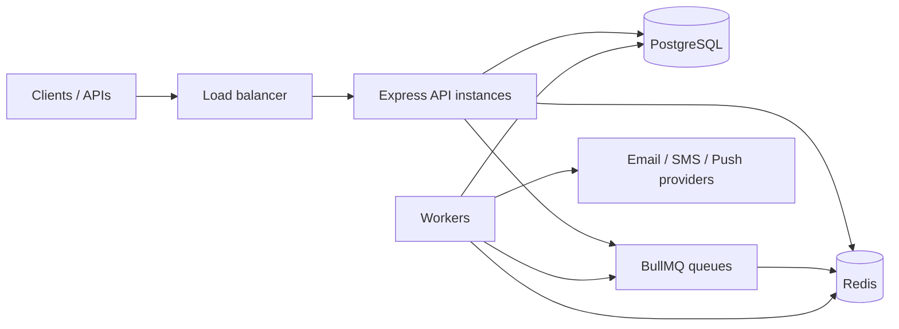

# Notification Service — Architecture & Project Plan

This document describes **why** this project exists, **what** is implemented today, **how** it is meant to work at scale, **what to build next**, and a **rough timeline** to a “learning-complete” advanced version.

---

## 1. Purpose and learning goals

### Why this project

We are building a **notification microservice** as a **learning vehicle** for production-style backend engineering: correct data modeling, asynchronous delivery, failure handling, and operations concerns (containers, health, graceful shutdown).

### What “advanced / at scale” means here

“Millions of users” or “very high request volume” in practice means:

| Concern | Idea |
|--------|------|
| **API throughput** | Stateless HTTP layer behind a load balancer; scale **horizontally** (many instances). |
| **Work separation** | Accept requests **fast** (validate, persist intent, enqueue); **deliver** in background **workers** (BullMQ + Redis). |
| **Data** | PostgreSQL for durability and queries; **indexes** and **pagination**; optional read replicas later. |
| **Caching & dedup** | Redis for cache-aside, idempotency, rate-limit state, and queue backing. |
| **Reliability** | Retries, dead-letter storage, idempotency keys, graceful shutdown. |
| **Safety** | Rate limits, input validation (Zod), structured errors, request IDs for tracing. |

We are **not** claiming this repo already sustains millions of RPS out of the box; the **design** and **incremental hardening** below are what make that class of system understandable and approachable.

---

## 2. High-level architecture

### Target logical view

- **API**: authentication/authorization (when added), validation, persistence of notifications, enqueue jobs, read APIs (list, status).
- **Workers**: pull jobs from BullMQ, load notification + user from DB, respect quiet hours and preferences, call providers, update status, handle retries.
- **PostgreSQL**: source of truth for users, notifications, templates, dead letters.
- **Redis**: queues (BullMQ), caching, optional distributed rate limiting, connection state.

### Repository layout (conceptual)

| Area | Location |
|------|----------|
| Environment & typed config | `src/config/environment.ts`, `src/config/index.ts` |
| PostgreSQL pool | `src/config/database.ts` |
| Redis client | `src/config/redis.ts` |
| Migrations | `src/db/migrations/*.sql`, `src/db/migrate.ts` |
| Domain types | `src/types/index.ts` |
| Zod API schemas | `src/schemas/*.ts` |
| HTTP middleware | `src/middleware/request-id.ts`, `src/middleware/validate.ts` |
| Caching | `src/services/cache.service.ts` |
| Logging, errors, shutdown | `src/utils/logger.ts`, `src/utils/errors.ts`, `src/utils/graceful-shutdown.ts` |
| Entry | `src/index.ts` (currently a stub) |

---

## 3. Current implementation status

This section is the **honest snapshot** of the codebase as of the last review. Use it to prioritize work.

### Done or largely in place

- **Environment**: Zod-validated `env` (`NODE_ENV`, `PORT`, `DATABASE_URL`, Redis, rate limit defaults, `LOG_LEVEL`, `CORS_ORIGIN`).
- **PostgreSQL**: shared `pg` pool, helpers for close and health-style checks (`src/config/database.ts`).
- **Redis**: singleton `ioredis` client with lazy connect and BullMQ-friendly settings (`src/config/redis.ts`).
- **Schema (SQL)**: Initial migration creates `users`, `notifications`, `notification_templates`, `dead_letter_notifications` with indexes and comments (`src/db/migrations/001_initial_schema.sql`). Runner: `pnpm db:migrate`.
- **Domain model (TypeScript)**: Channels, statuses, priorities, `User`, `Notification`, templates, DLQ, job payload, pagination, `HealthStatus` (`src/types/index.ts`).
- **Zod schemas**: User and notification-related schemas (`src/schemas/`).
- **Middleware**: Request ID propagation; generic Zod validation middleware for body/query/params (`src/middleware/`).
- **Cache layer**: Redis cache-aside with TTLs and safe degradation on Redis failure (`src/services/cache.service.ts`).
- **Cross-cutting**: Logger, structured app errors, graceful shutdown helper (intended to wire HTTP server + pool + Redis + workers).
- **Container sketch**: `Dockerfile`, `docker-compose.yml` (app + Postgres; **Redis not in compose yet**).
- **Dependencies**: Express, BullMQ, `pg`, `ioredis`, Zod, security/rate-limit stack — aligned with the intended architecture.

### Phase B additions (vertical slice: create → enqueue → worker)

- **API endpoint**: `POST /api/notifications` validates using `createNotificationSchema`, persists a row, and (if not scheduled) enqueues a BullMQ job.
- **Queue module**: `src/queue/notification.queue.ts` defines queue + job name and a single enqueue function; priority mapping is centralized.
- **Worker process**: `src/worker.ts` consumes jobs, marks `processing → sent`, and records failures with retries. Delivery is currently a safe **stub sender**.
- **Docs**: README now includes how to run API + worker and how to call the new endpoint.

### User management (foundation for notifications)

- **API endpoints**: `src/routes/users.ts` implements:
  - `POST /api/users` (create user)
  - `GET /api/users` (paginated list)
  - `GET /api/users/:id` (fetch user)
  - `PATCH /api/users/:id/preferences` (update channel + quiet hours + timezone)
- **Repository/service split**: SQL lives in `src/repositories/users.repository.ts`, orchestration and client-facing errors live in `src/services/users.service.ts`.

### Not implemented yet (gaps)

| Gap | Impact |
|-----|--------|
| **`src/index.ts` is a stub** | No HTTP server, no routes, no health endpoint wired. |
| **No Express app module** | No central `app.ts` with helmet, cors, morgan, rate limit, error handler. |
| **No routes or controllers** | No REST API for create/list/cancel notifications or users. |
| **No service layer for notifications** | No orchestration between DB, queue, and cache for the main flows. |
| **No real channel implementations** | Delivery is stubbed (logs only). Real email/SMS/push adapters come later. |
| **No channel implementations** | No email/SMS/push adapters (likely stubs or sandbox providers for learning). |
| **Docker / local dev mismatch** | `Dockerfile` uses `npm`; repo uses **pnpm** in `package.json`. Compose does not include **Redis**; app depends on Redis for queues/cache. |
| **Tests** | No automated tests listed in scripts beyond a placeholder `test` script. |
| **Authn/z** | No API keys, JWT, or service-to-service auth. |
| **Observability** | No metrics (Prometheus), tracing (OpenTelemetry), or structured log correlation beyond request ID. |
| **Migration tracking** | Migration runner runs raw SQL; no `schema_migrations` table (documented as acceptable for bootstrap, not for large teams). |

**Verdict:** Foundations and **horizontal concerns** (config, DB, Redis, types, validation, cache, shutdown story) are strong. The **product vertical slice** (HTTP → DB → queue → worker → provider) is the main missing body of work.

---

## 4. Scale and reliability patterns (reference)

These are the patterns this codebase is **structured to support** as you implement the missing pieces.

### Request path (write)

1. Validate input (Zod middleware).
2. Check **idempotency** (Redis or DB unique on `idempotency_key`).
3. Insert notification row (status `pending` / `queued`).
4. Enqueue BullMQ job with minimal `NotificationJobData`.
5. Return `202` or `201` quickly with IDs — do not block on external providers.

### Worker path

1. Worker receives job; loads notification and user from PostgreSQL.
2. Apply **quiet hours** and **preferred_channels**; optionally reschedule.
3. Call provider; on success update status and timestamps; on failure increment attempts and retry with backoff or move to **dead letter** after `max_attempts`.

### Horizontal scaling

- **API**: N identical instances; sticky sessions not required if JWT/API key is in header.
- **Workers**: Separate processes or containers; scale worker count based on queue depth and provider rate limits.
- **PostgreSQL**: Connection pool sizing per instance; avoid N × huge pools. Later: read replicas for read-heavy dashboards.
- **Redis**: Single primary is fine for learning; production clusters use Redis Cluster/Sentinel or managed Redis.

### Rate limiting and abuse

- Per-IP limits (already in dependencies) for HTTP.
- Per-user or per-tenant limits for **notification creation** (Redis counters or DB quotas) to protect providers and costs.

---

## 5. Roadmap — recommended next moves

Phases are ordered so each phase **delivers a runnable, observable slice**.

### Phase A — Runnable API (local)

1. Add `src/app.ts` (or similar): Express 5, helmet, cors, morgan, JSON body, `requestId` middleware, global error handler.
2. Replace `src/index.ts` stub: load `env`, connect Redis, test DB, `listen`, `setupGracefulShutdown`.
3. Implement `GET /health` returning `HealthStatus`-shaped JSON (DB + Redis + queue placeholder).
4. Add **Redis** to `docker-compose.yml`; align **Dockerfile** with **pnpm** (multi-stage, `pnpm install --frozen-lockfile` or equivalent).
5. Smoke-test: `docker compose up`, hit `/health`.

### Phase B — Core notification flow

1. Notification **repository** (SQL) + **service** (create, get by id, list with pagination).
2. `POST /notifications` (validated body), persist, enqueue BullMQ job, return created resource.
3. BullMQ **Queue** setup shared module; **Worker** process (same repo, second entry file e.g. `src/worker.ts`) that processes jobs and updates DB status.
4. Stub **channel handler** (e.g. log-only or mock “sent”) for one channel; wire retries and dead-letter row on final failure.

### Phase C — Learning “advanced” depth

1. Second channel + template interpolation from `notification_templates`.
2. Idempotency end-to-end (header or body key + unique constraint + Redis short-circuit).
3. Metrics: basic `/metrics` or Prometheus client; RED metrics for HTTP.
4. Load test script (k6 or autocannon) and document rough numbers **on your hardware** (honest, not marketing).
5. Optional: OpenTelemetry, structured JSON logs, API key auth for internal callers.

### Phase D — Polish for portfolio / interviews

1. README runbook: env vars, migrate, dev, worker, compose.
2. Unit tests (services, validation) + one integration test (DB + Redis testcontainers or CI service containers).
3. `schema_migrations` table or adopt a small migration tool if you outgrow raw SQL files.

---

## 6. Estimated effort and “end of project”

Estimates assume **part-time learning** (evenings/weekends), **one primary developer**, and scope **through Phase C** unless you explicitly want Phase D polish.

| Phase | Scope | Rough calendar time |
|-------|--------|----------------------|
| **A** | HTTP app, health, compose/Redis/Docker alignment | **3–7 days** |
| **B** | CRUD + queue + worker + stub channel + DLQ path | **2–4 weeks** |
| **C** | Idempotency, metrics, second channel, load testing | **2–4 weeks** |
| **D** | Tests, README hardening, migration tracking | **1–2 weeks** |

**Overall:** a **learning-complete, advanced-feeling** milestone is realistic in about **6–10 weeks** part-time, or **3–6 weeks** if you can invest focused full-time blocks. Adding real third-party providers (SES, Twilio, FCM) with sandbox accounts and webhooks adds **1–2+ weeks** depending on how deep you go.

These ranges are **not deadlines** — they depend on familiarity with Node, SQL, Redis, and Docker. The roadmap above is the real checklist; the dates are for planning only.

---

## 7. How to use this document

- **Status**: Re-read §3 when you merge features; update the tables so the doc stays truthful.
- **Next step**: Start **Phase A** until `/health` is green with Postgres + Redis in Docker.
- **Scale story**: §4 is the reference for interviews and design reviews; tie implemented code to those bullets as you build.

---

*Last updated: aligned with repository layout and files under `src/`, `docker-compose.yml`, and `Dockerfile`.*
